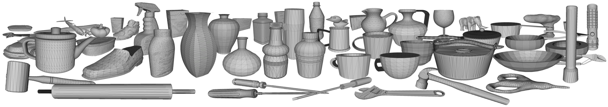

.. Dex-Net documentation master file, created by
   sphinx-quickstart on Thu Oct 20 10:31:18 2016.
   You can adapt this file completely to your liking, but it should at least
   contain the root `toctree` directive.

Berkeley AUTOLAB's Dex-Net Package
==================================

Overview
--------
The `dex-net` package contains a Python API for managing HDF5 databases of 3D object models, parallel-jaw grasps, and grasp robustness metrics from used in the `Dex-Net 2.0 paper`_. The package supports reading the `Dex-Net 2.0 HDF5 Database`_ containing parallel-jaw grasps for the ABB YuMi across 1,500 object models from the `Dex-Net Object Mesh Dataset v1.1`_, and also supports the creation of databases with custom datasets of object models. The package is part of the `Dexterity Network (Dex-Net)`_ project and is maintained by the `Berkeley AUTOLAB`_.

See the `installation instructions`_ and `tutorials`_ to get started!

.. _installation instructions: https://berkeleyautomation.github.io/dex-net/install/install.html
.. _tutorials: https://berkeleyautomation.github.io/dex-net/tutorials/tutorial.html

Links
-----
* `Source Code`_
* `Dex-Net 2.0 HDF5 Database`_
* `Dex-Net Object Mesh Dataset v1.1`_
* `Dex-Net 2.0 Paper`_
* `Dex-Net Website`_
* `UC Berkeley AUTOLAB`_

.. _Source Code: https://github.com/BerkeleyAutomation/dex-net
.. _Dex-Net 2.0 HDF5 Database: http://bit.ly/2vb3OCz
.. _Dex-Net Object Mesh Dataset v1.1 : http://bit.ly/2tLnRrQ
.. _Dex-Net 2.0 Paper: https://github.com/BerkeleyAutomation/dex-net/raw/gh-pages/docs/dexnet_rss2017_final.pdf
.. _Dex-Net Website: https://berkeleyautomation.github.io/dex-net
.. _UC Berkeley AUTOLAB: http://autolab.berkeley.edu

Project Goals
-------------
The goals of this project are to facilitate:

1) **Replicability** of results from the `Dex-Net 2.0 paper`_.
2) **Research extensions** on using synthetic datasets of 3D object models with physics-based robustness metrics as a prior for robot grasping and manipulation.

System Requirements
-------------------
Grasp robustness metrics from the `dex-net` are only known to predict success for lifting and transporting objects on a physical robot with:

1) An ABB YuMi robot with a custom parallel-jaw gripper with silicone tips.
2) Test objects from the `Dex-Net 2.0 paper`_, which (a) have available grasps in every resting pose (e.g. not flat against the table), (b) weigh less than 0.25kg, the payload of the YuMi, and (c) are partially opaque to enable measurement with a depth sensor.

We are currently researching how to generate databases that can generalize across robots and additional objects.
If you are interested in this functionality, please email Jeff Mahler (jmahler@berkeley.edu) with the subject line "Interested in GQ-CNN Dataset Generation."

Development
-----------
The package is currently under active development. Installation has been tested on Ubuntu 12.04, 14.04, and 16.04.

Please raise all bugs, feature requests, and other issues under the `Github Issues`_.
For other questions or concerns, please contact Jeff Mahler (jmahler@berkeley.edu) with the subject line starting with "dex-net development: "

Active developers include:

* `Jeff Mahler`_
* Alan Li
* Matt Matl
* Vishal Satish
* Jacky Liang
* Xinyu Liu

.. _Jeff Mahler: https://www.jeff-mahler.com

Academic Use
------------
If you use the code, datasets, or models in a publication, please `cite the Dex-Net 2.0 paper`_.
If you use the 3D object models, then we recommend that you also cite the original sources of the data:

1) `3DNet`_
2) `KIT Object Database`_ 

.. _Dexterity Network (Dex-Net): https://berkeleyautomation.github.io/dex-net

.. _Berkeley AUTOLAB: http://autolab.berkeley.edu/

.. _Dex-Net 2.0 paper: https://github.com/BerkeleyAutomation/dex-net/raw/gh-pages/docs/dexnet_rss2017_final.pdf

.. _Github Issues: https://github.com/BerkeleyAutomation/dex-net/issues

.. _cite the Dex-Net 2.0 paper: https://github.com/BerkeleyAutomation/dex-net/raw/gh-pages/docs/dexnet_rss2017.bib

.. _3DNet: https://repo.acin.tuwien.ac.at/tmp/permanent/3d-net.org/
.. _KIT Object Database: https://h2t-projects.webarchiv.kit.edu/Projects/ObjectModelsWebUI/

.. toctree::
   :maxdepth: 2
   :caption: Installation Guide

   install/install.rst

.. toctree::
   :maxdepth: 2
   :caption: Data

   data/data.rst

.. toctree::
   :maxdepth: 2
   :caption: Tutorial

   tutorials/tutorial.rst

.. toctree::
   :maxdepth: 2
   :caption: Documentation for Scripts
   :glob:

   scripts/*

.. toctree::
   :maxdepth: 2
   :caption: API Documentation
   :glob:

   api/*

Indices and tables
==================

* :ref:`genindex`
* :ref:`modindex`
* :ref:`search`
