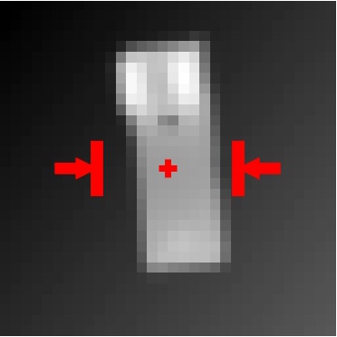

Point Cloud Dataset Generation
------------------------------
Robust grasping policies based on `Grasp Quality Convolutional Neural Networks`_ (GQ-CNNs) may be useful for planning grasps on novel objects with a physical robot.
This requires training GQ-CNNs on a dataset of synthetic point clouds, grasps, and grasp robustness metrics such as the `Dex-Net 2.0 dataset`_.

It may be beneficial to train GQ-CNNs on custom robot grippers and datasets of 3D object models based on the application. To facilitate research on this topic, `dex-net` contains the script `generate_gqcnn_dataset.py`_ under the tools/ directory.
This tutorial explains how to use this tool.

.. _Grasp Quality Convolutional Neural Networks: https://berkeleyautomation.github.io/gqcnn
.. _Dex-Net 2.0 dataset: http://bit.ly/2rIM7Jk
.. _generate_gqcnn_dataset.py: https://github.com/BerkeleyAutomation/dex-net/blob/master/tools/generate_gqcnn_dataset.py

Install OpenRAVE
~~~~~~~~~~~~~~~~
Dataset generation currently requires `OpenRAVE`_ for collision checking. Install our fork of OpenRAVE 0.9 by running the following from a command line::

   $ cd /path/to/your/dexnet/deps
   $ git clone https://github.com/jeffmahler/openrave.git
   $ cd openrave
   $ sudo sh install.sh
   $ cd ../..

.. _OpenRAVE: https://github.com/jeffmahler/openrave

Download the Example Database
~~~~~~~~~~~~~~~~~~~~~~~~~~~~~
Download the `example HDF5 database`_ containing the adversarial training objects to a location of your choosing.
Throughout the tutorial we will refer to the location as /path/to/your/example.hdf5

.. _example HDF5 database: http://bit.ly/2tGPXWz

Check the Configuration File
~~~~~~~~~~~~~~~~~~~~~~~~~~~~
The point cloud dataset generation script has a number of `parameters`_ specifying the database, object models to use, robot gripper, and camera parameters.
At minimum you will need to update the `database_name` parameter of your configuration file (ex. `/path/to/your/dex-net/cfg/tools/generate_gqcnn_dataset.yaml`) to point to the example database::

	database_name: /path/to/your/example.hdf5

.. _parameters: ../scripts/tools.html

Run the Python Script
~~~~~~~~~~~~~~~~~~~~~
Choose a location for the dataset, such as /path/to/your/gqcnn_dataset
Then run the following out of the root of your `dex-net` repo::

	$ python tools/generate_gqcnn_dataset.py /path/to/your/gqcnn_dataset

The script proceeds in two stages: (1) checking collisions and (2) associating grasps with location in synthetic rendered point clouds. Execution may take tens of minutes for the default configuration and example database.

Visualize the Dataset
~~~~~~~~~~~~~~~~~~~~~
If the dataset generation script successfully finishes, then you can visualize point clouds from the resulting dataset using the script `visualize_gqcnn_dataset.py`_ under the tools/ directory.

The point cloud dataset generation script has a few `parameters`_ that can filter the dataset by positive or negative examples, specified in `/path/to/your/dex-net/cfg/tools/visualize_gqcnn_dataset.yaml`.
We strongly recommend using the defaults, which will visualize positive examples.

Run the following from a command line::

   $ python tools/generate_gqcnn_dataset.py /path/to/your/gqcnn_dataset

You should see images similar to:

.. _visualize_gqcnn_dataset.py: https://github.com/BerkeleyAutomation/dex-net/blob/master/tools/visualize_gqcnn_dataset.py
.. _parameters: ../scripts/tools.html
